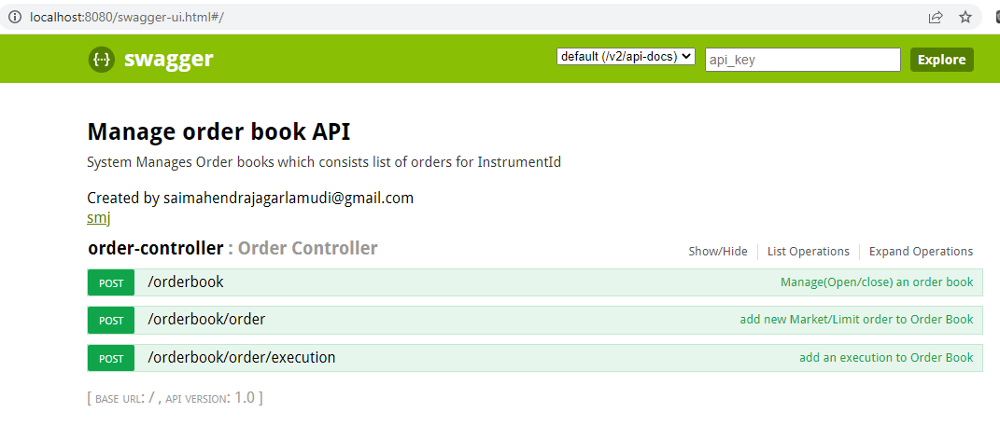
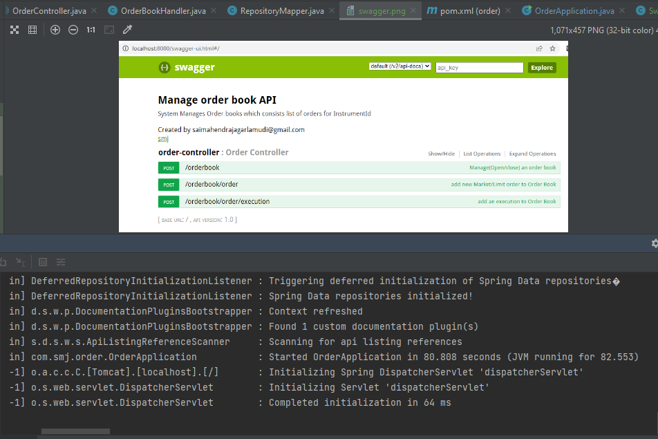
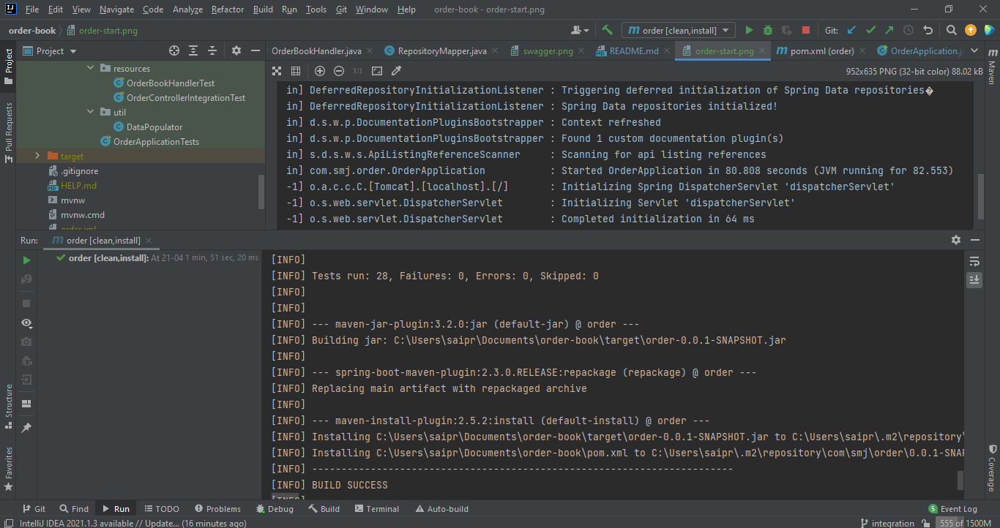

## System Manages Order books consists list of orders for InstrumentId

## Running `Manage Order Book API` locally
Order Book API is a [Spring Boot] application built using [Maven]. You can build a jar file and run it from the command line:

```
cd order-book
./mvn clean install
./mvn spring-boot:run or 
.java -jar target/*.jar
```

You can then access order-book here using endpoint : http://localhost:8080/swagger-ui.html


**##To Open an orderBook and then add an Order**
```
curl -X POST -H "Content-Type: application/json" -H "accept: application/json" --data $'{"instrumentId":135, "instrumentName":"instrumentName1", "orderBookStatus":"Open"}' "http://localhost:8080/orderbook"
curl -X POST -H "Content-Type: application/json" -H "accept: application/json" --data $'{"instrumentId":135,"orderBookId":1234567890,"orderQuantity":10,"price":100.0,"entryDate":"2022-04-21T15:52:27.515","orderType":"Limit order"}' "http://localhost:8080/orderbook/order"
```
**##To Close an orderBook and then add an execution**
```
curl -X POST -H "Content-Type: application/json" -H "accept: application/json" --data $'{"instrumentId":136, "instrumentName":"instrumentName2", "orderBookStatus":"Close"}' "http://localhost:8080/orderbook"
curl -X POST -H "Content-Type: application/json" -H "accept: application/json" --data $'{"instrumentId":136,"quantity":10,"price":200.0}' "http://localhost:8080/orderbook/order/execution"
```



